# Radar de Editais

Plataforma de IA para mapear o ecossistema brasileiro de inovação, cruzar o
perfil de startups deep-tech com editais, programas e investidores e desenvolver
propostas ou pitches com escrita assistida por RAG.

> IA rascunha, o humano decide.

## Arquitetura

```mermaid
flowchart LR
    %% Input channels → hub
    FONTES[Agências<br/>FINEP/FAPESP/FAPESC] --> SILVER[Silver<br/>extração + normalização]
    DESC[Descoberta Web<br/>busca + adapters] --> EVID[Evidências canônicas<br/>Crawl4AI opcional no worker]
    EVID --> GATE[Staging + gate admin]
    GATE -->|promote| BRONZE[Bronze web<br/>versão aprovada]
    BRONZE --> SILVER
    SILVER --> GOLD

    GOLD[("Gold — Catálogo<br/>Postgres · entidades<br/>match_chunks")]

    %% Spoke 1: Match
    subgraph MATCH["① Radar — Match"]
        PERFIL[Perfil Empresa] --> S0[Stage 0: Vigência]
        S0 --> S1[Stage 1: Elegibilidade]
        S1 --> S2[Stage 2: MaxSim · zero LLM]
        S2 --> S3[Stage 3: Veredito gpt-4o-mini]
        S3 --> RANK[Ranking + Trilha Investidor]
    end

    GOLD -->|entidades + match_chunks| MATCH

    %% Ingest pipeline (on demand)
    subgraph INGEST["Pré-processamento (sob demanda)"]
        EDITAL_RAW[Edital raw] --> CHUNKER[Chunker estrutural<br/>Art. / §]
        CHUNKER --> CR[Contextual Retrieval<br/>LLM injeta contexto do capítulo]
        CR --> EMBED[Embedder<br/>text-embedding-3-small]
    end

    GOLD -.->|edital raw| INGEST
    EMBED --> EC

    EC[(edital_chunks<br/>pgvector + tsvector)]

    %% Spoke 2: Writing + RAG
    subgraph ESCRITA["② Escrita Assistida"]
        EC --> HYDE[HyDE]
        EC --> BM25
        HYDE --> DENSE[pgvector]
        DENSE --> RRF[RRF]
        BM25 --> RRF
        RRF --> RERANK[Rerank] --> TK[Top-k]
        TK --> WS[WritingSession LangGraph]
        WS --> DRAFT[Rascunho + Citações]
    end

    RANK -->|ranking| ESCRITA

    %% Spoke 3: Explore
    subgraph EXPLORE["③ Explorar — Mapa"]
        HG[Grafo relacional<br/>entidades · relações · tags] --> EA[ExploreAgent ReAct]
        EA --> RESP[Respostas → profile_diff]
    end

    GOLD -->|entidades| HG

    style GOLD fill:#e6f3ff,stroke:#0066cc,stroke-width:2px,color:#000
```



- **Descoberta**: busca web e adapters dedicados → evidências canônicas → staging com gate humano. A versão promovida é congelada em bronze web e segue para silver → gold como qualquer edital de agência; Crawl4AI é um enriquecimento opcional do worker, não substitui adapters nem o pipeline nativo.
- **Radar (Match)**: funil determinístico de 4 estágios — vigência (SQL) → elegibilidade → MaxSim (zero LLM) → veredito gpt-4o-mini no top-K. Trilha investidor paralela por cosseno de tese.
- **Explorar**: catálogo do Ecossistema + agente ReAct com busca semântica, vizinhança nas relações gold, entidades por tags e o motor de match como ferramenta.
- **Projetos**: propostas e pitches em sessões LangGraph com checkpointer Postgres durável, RAG híbrida (HyDE + pgvector + BM25 + RRF + rerank), ficha da oportunidade via catálogo e checklist paralelo 3-passos.
- **Runtime**: 5 tiers de LLM independentes por env var (embedding, contextual, extração, explore, escrita).

## Stack

**Backend** Python (FastAPI + LangGraph + procrastinate) ·
**Frontend** Next.js 14 (TypeScript + Tailwind + Radix) ·
**Dados** Supabase (Postgres + pgvector + Auth) ·
**LLM** OpenAI + Anthropic ·
**Observabilidade** Langfuse ·
**Deploy** Docker + Cloudflare Tunnel + Vercel

## Rode local

```bash
pip install -e . && supabase start
uvicorn backend.api:app --reload --port 8000
```

Setup completo, testes, lint e eval: [`AGENTS.md`](AGENTS.md). Diagramas
detalhados: [`docs/architecture.md`](docs/architecture.md). Índice da
documentação: [`docs/README.md`](docs/README.md).

## Estrutura

```
backend/     FastAPI: routers por domínio + common.py
core/        services/ · kg/ · retrieval/ · llm/ · eval/
domain/      CompanyProfile (dataclass)
pipeline/    ETL multi-fonte (extractors + adapters)
frontend/    Next.js 14
supabase/    Migrações + config CLI
docs/        índice, arquitetura atual, specs, referências e histórico
wikis/       Schema/vocabulários por fonte (doc-as-config)
```

---

Demo: [radar-editais-gold.vercel.app](https://radar-editais-gold.vercel.app)
