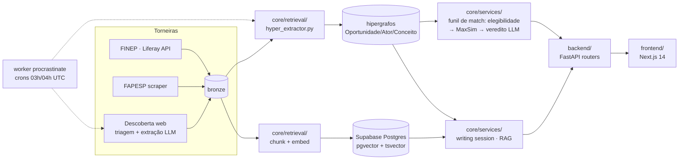

# Radar de Editais

Radar de fomento para startups deep-tech brasileiras. A plataforma cruza o
perfil da empresa com **quatro quadrantes** de oportunidade — editais públicos
(FINEP, FAPESP, …), desafios de inovação aberta, programas de
aceleração/incubação e investidores — num ranking único, e acompanha o usuário
até a entrega: brief GO/NO-GO, escrita assistida da proposta (RAG sobre o
edital), revisão automática em 3 passes e pipeline Kanban de candidaturas.

Filosofia do produto: **a IA rascunha, o humano decide** — nada é submetido,
salvo ou alterado sem revisão humana.

**Demo ao vivo:** [radar-editais-gold.vercel.app](https://radar-editais-gold.vercel.app)

## Stack

- **Backend**: Python — FastAPI + [LangGraph](https://langchain-ai.github.io/langgraph/)
  (runtime agêntico com checkpointer Postgres durável) + procrastinate (worker
  de jobs assíncronos/crons)
- **Frontend**: Next.js 14 (App Router) + TypeScript + Tailwind + Radix UI
- **Dados**: Supabase (Postgres + pgvector + Auth + Storage)
- **LLM**: OpenAI (embeddings, extração, tiers 1-3) e Anthropic (agentes de
  escrita/exploração, tier 4-5) — trocáveis por env var, ver [CLAUDE.md](CLAUDE.md)
- **Observabilidade**: Langfuse (traces LLM + eval)
- **Deploy**: Docker Compose (app + worker atrás de um Cloudflare Tunnel) +
  Vercel (frontend) + Supabase Cloud (dados) — ver
  [docs/architecture.md §0](docs/architecture.md#0-deploy--camadas-de-produção)

## Arquitetura

Visão de alto nível — diagramas Mermaid detalhados (data plane, funil de
match, runtime agêntico, eval) em [docs/architecture.md](docs/architecture.md).



- **Dados**: hipergrafo N-ário (KG v2 — 3 tipos de nó: `Oportunidade`/`Ator`/`Conceito`)
  extraído por LLM a partir do bronze; substituiu o índice/wiki-pages legados.
- **Match**: funil de 3 estágios — filtro duro de elegibilidade (determinístico)
  → afinidade MaxSim (cosseno, sem LLM) → veredito LLM no top-K. Investidores
  casam por tese. Itens descobertos automaticamente entram rotulados
  `provisorio` até aprovação humana.
- **Escrita**: sessões LangGraph persistidas em Postgres, RAG sobre os chunks
  do edital, checklist de compliance em paralelo e critic pós-draft.
- **Avaliação**: harness unificado (`python -m core.eval <suite>`) com 9
  suítes — mudanças de prompt/pipeline são gated por eval.

## Como rodar

### Docker Compose (recomendado)

Pré-requisitos: Docker, [Supabase CLI](https://supabase.com/docs/guides/cli)
(para o Postgres local) ou um projeto Supabase Cloud.

```bash
supabase start                   # Postgres local (54322) + Auth + Storage
supabase status                  # copie URL/keys/JWT para o .env (base: .env.example)

docker compose up -d --build     # sobe app (FastAPI, :8000) + worker (procrastinate)
```

O `worker` roda os crons de scrape/descoberta (03:00/04:00 UTC) e os jobs de
chunking/enriquecimento — sem ele essas filas nunca processam. Runbook
completo de deploy (Cloudflare Tunnel + Vercel): [scripts/deploy.sh](scripts/deploy.sh).

Frontend:
```bash
cd frontend && npm install && npm run dev        # porta 3000
```

### Dev com hot-reload (alternativa sem Docker)

```bash
pip install -e .
uvicorn backend.api:app --reload --port 8000              # docs em /docs
python -m procrastinate --app=core.tasks.app worker        # worker
```

Comandos de teste, lint e eval: ver [CLAUDE.md](CLAUDE.md).

## Estrutura

```
backend/    FastAPI: api.py (shell) + routers/ por domínio + common.py
core/       services/ (match, escrita, revisão) · kg/ (store, schema, identidade)
            retrieval/ (chunk, embed, busca, hyper_extractor) · llm/ (client, agentes, tools)
            eval/ (harness) · flat: tasks, auth, db, descoberta (web/DOU), …
domain/     CompanyProfile (dataclass de perfil)
pipeline/   ETL multi-fonte (extractors/, adapters/ por fonte)
frontend/   Next.js 14 (App Router)
supabase/   migrations + config do CLI local
docs/       architecture.md, ROADMAP, specs por frente, BACKLOG
wikis/      schema/vocabulários por fonte (doc-as-config)
```

## Convenções

- **Imports absolutos** (`from core.services... import …`); o pacote é instalado
  com `pip install -e .` — nunca `sys.path` hacks.
- **Regra vive no doc, não no código**: vocabulário/workflows de ingestão em
  [WIKI.md](WIKI.md)/`wikis/*.md`; o código lê via `core/kg/schema.py`.
- **Eval-gated**: mexeu em prompt/pipeline → rode a suíte correspondente; não
  crie harnesses paralelos (registre em `core/eval/registry.py`).
- **Routers por domínio** no backend; dependências compartilhadas em
  `backend/common.py`.
- CI roda `ruff check .` + pytest + build do frontend.

## Documentação

Arquitetura para agentes/contribuidores: [CLAUDE.md](CLAUDE.md); diagramas
detalhados: [docs/architecture.md](docs/architecture.md); direção do produto:
[docs/ROADMAP.md](docs/ROADMAP.md); decisões fundacionais:
[ADR-001](docs/historical/ADR-001-decisoes-iniciais.md).
