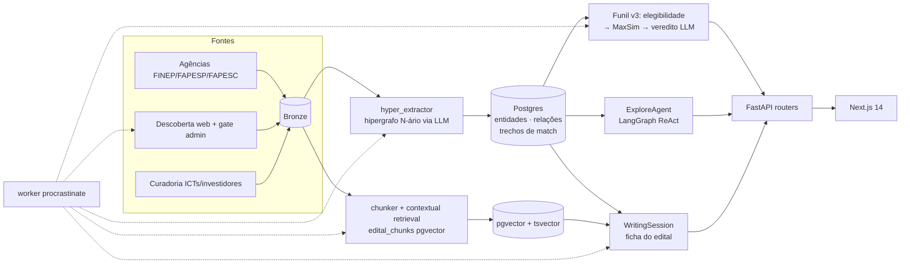

# Radar de Editais

Plataforma de IA que cruza o perfil de startups deep-tech brasileiras com
oportunidades de fomento público — editais, programas e investidores — em ranking
único, com escrita assistida de propostas via RAG.

> IA rascunha, o humano decide.

## Arquitetura



- **Match**: funil determinístico de 4 estágios — vigência (SQL) → elegibilidade
  → afinidade MaxSim (zero LLM) → veredito gpt-4o-mini no top-K
- **Explore**: agente ReAct com busca semântica, BFS em hipergrafo e o match
  como ferramenta
- **Escrita**: sessões LangGraph com checkpointer Postgres, RAG híbrida (densa +
  BM25 + rerank), checklist paralelo 3-passos
- **Runtime**: 5 tiers de LLM independentes por env var (embedding, contextual,
  extração, explore, escrita)

## Stack

**Backend** Python (FastAPI + LangGraph + procrastinate) ·
**Frontend** Next.js 14 (TypeScript + Tailwind + Radix) ·
**Dados** Supabase (Postgres + pgvector + Auth) ·
**LLM** OpenAI + Anthropic ·
**Observabilidade** Langfuse ·
**Deploy** Docker + Cloudflare Tunnel + Vercel

## Rode local

```bash
pip install -e . && supabase start
uvicorn backend.api:app --reload --port 8000
```

Setup completo, testes, lint, eval: [`CLAUDE.md`](CLAUDE.md). Diagramas
detalhados: [`docs/architecture.md`](docs/architecture.md).

## Estrutura

```
backend/     FastAPI: routers por domínio + common.py
core/        services/ · kg/ · retrieval/ · llm/ · eval/
domain/      CompanyProfile (dataclass)
pipeline/    ETL multi-fonte (extractors + adapters)
frontend/    Next.js 14
supabase/    Migrações + config CLI
docs/        architecture.md, ROADMAP, specs, BACKLOG
wikis/       Schema/vocabulários por fonte (doc-as-config)
```

---

Demo: [radar-editais-gold.vercel.app](https://radar-editais-gold.vercel.app)
