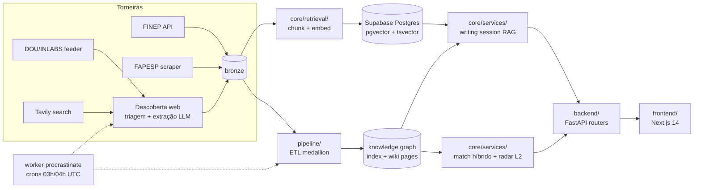

# Radar de Editais

Radar de fomento para startups deep-tech brasileiras. A plataforma cruza o
perfil da empresa com **quatro quadrantes** de oportunidade — editais públicos
(FINEP, FAPESP, …), desafios de inovação aberta, programas de
aceleração/incubação e investidores — num ranking único, e acompanha o usuário
até a entrega: brief GO/NO-GO, escrita assistida da proposta (RAG sobre o
edital), revisão automática em 3 passes e pipeline Kanban de candidaturas.

Filosofia do produto: **a IA rascunha, o humano decide** — nada é submetido,
salvo ou alterado sem revisão humana.

## Arquitetura



- **Dados**: pipeline medallion (bronze cru → índice consolidado + wiki pages
  por edital). O schema dos dados é **autoritativo em doc**
  ([WIKI.md](WIKI.md) + `wikis/<fonte>.md`); o código o lê via
  `core/kg/wiki_schema.py` e um teste garante que doc e código não divergem.
- **Match**: scoring determinístico (Stage 1) + LLM semântico (Stage 2);
  investidores casam por tese; o radar L2 funde tudo com Reciprocal Rank
  Fusion. Itens descobertos automaticamente entram rotulados `provisorio`.
- **Escrita**: sessões persistidas em Postgres, RAG sobre os chunks do edital,
  compliance monitor em paralelo e critic pós-draft.
- **Avaliação**: harness unificado (`python -m core.eval <suite>`) com suítes de
  matching, RAG, escrita e extração — mudanças de prompt/pipeline são gated por
  eval.

## Stack

FastAPI + procrastinate (worker) · Next.js 14 + TypeScript + Tailwind ·
Supabase (Postgres + pgvector + Auth + Storage) · OpenAI (embeddings,
extração) e Anthropic (agentes de escrita/exploração) · Langfuse
(observabilidade) · deploy Vercel (frontend) + Railway (backend/worker).

## Como rodar

Pré-requisitos: Docker, [Supabase CLI](https://supabase.com/docs/guides/cli),
Python ≥3.10, Node 20.

```bash
# 1. Stack local do Supabase (Postgres + Auth + Storage; aplica migrations)
./scripts/dev.sh                 # = supabase start
supabase status                  # copie URL/keys/JWT para o .env (base: .env.example)

# 2. Backend
pip install -e .
uvicorn backend.api:app --reload --port 8000     # docs em /docs

# 3. Worker (jobs: enriquecimento, chunking, crons de scrape/descoberta)
#    Usa o mesmo .env da API; DATABASE_URL aponta pro Postgres local (porta 54322)
python -m procrastinate --app=core.tasks.app worker

# 4. Frontend
cd frontend && npm install && npm run dev        # porta 3000
```

Para reaplicar migrations do zero: `supabase db reset`. Para parar:
`supabase stop`.

### Pipeline de dados (manual)

```bash
python pipeline/build_knowledge_graph.py   # bronze → índice + grafo (todas as fontes)
python -m core.opportunity_discovery       # torneira web (Tavily; DOU com DISCOVERY_DOU_ENABLED=1)
python -m core.eval matching               # avaliação (Langfuse se configurado)
```

Em produção os scrapers e a Descoberta rodam pelos crons do worker
(03:00/04:00 UTC).

## Estrutura

```
backend/    FastAPI: api.py (shell) + routers/ por domínio + common.py
core/       services/ (match, escrita, revisão) · kg/ (store, schema, identidade)
            retrieval/ (chunk, embed, busca) · llm/ (client, agentes, tools)
            eval/ (harness) · flat: tasks, auth, db, descoberta (web/DOU), …
domain/     CompanyProfile (dataclass de perfil)
pipeline/   ETL multi-fonte (extractors/, adapters/, build_knowledge_graph)
frontend/   Next.js 14 (App Router)
supabase/   migrations + config do CLI local
docs/       ROADMAP, specs por frente, BACKLOG
wikis/      schema/vocabulários por fonte (doc-as-config)
```

## Convenções

- **Imports absolutos** (`from core.services... import …`); o pacote é instalado
  com `pip install -e .` — nunca `sys.path` hacks.
- **Regra vive no doc, não no código**: schema/vocab/queries em
  WIKI.md/`wikis/*.md`; o código lê via `wiki_schema`.
- **Eval-gated**: mexeu em prompt/pipeline → rode a suíte correspondente; não
  crie harnesses paralelos (registre em `core/eval/registry.py`).
- **Routers por domínio** no backend; dependências compartilhadas em
  `backend/common.py`.
- CI roda `ruff check .` + pytest + build do frontend.

## Deploy

Frontend na Vercel, backend + worker na Railway (mesma imagem Docker), dados no
Supabase Cloud. Runbook passo-a-passo: [scripts/deploy.sh](scripts/deploy.sh).
Guia detalhado de arquitetura para agentes/contribuidores: [CLAUDE.md](CLAUDE.md);
direção do produto: [docs/ROADMAP.md](docs/ROADMAP.md); decisões fundacionais:
[ADR-001](docs/historical/ADR-001-decisoes-iniciais.md).
