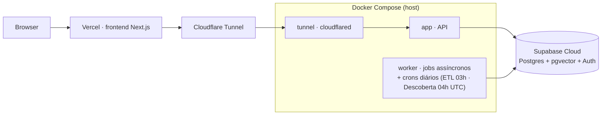
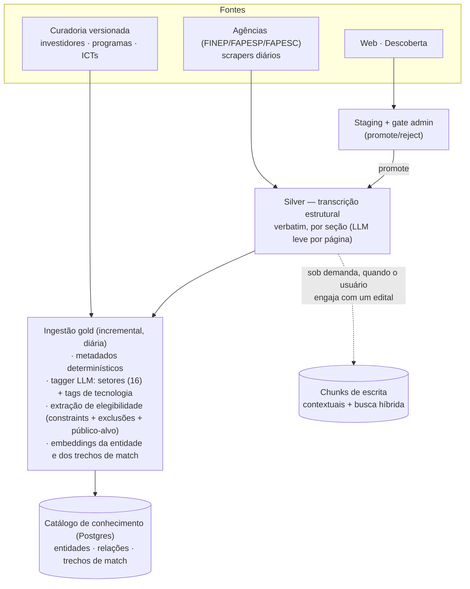

# Arquitetura — Radar de Editais

O produto conecta empresas early-stage/PME a oportunidades de fomento público
brasileiro através de **quatro funcionalidades**: **Radar** (match
empresa↔oportunidade), **Escrita assistida** (propostas com RAG sobre o edital),
**Mapeamento do ecossistema** (catálogo + exploração conversacional de atores e
programas) e **Descoberta** (torneira de novas oportunidades com gate humano).

Arquitetura v3 (concluída 2026-07-11): representações especializadas por
funcionalidade derivadas da mesma fonte — filtros estruturados + embeddings de
texto real para o match, tabelas relacionais para navegação, chunks contextuais
para escrita. Spec: [`docs/specs/v3-unified.md`](specs/v3-unified.md).

---

## 0. Deploy

Backend em Docker no host do operador, exposto via Cloudflare Tunnel (sem porta
aberta); frontend na Vercel; dados no Supabase Cloud.

---

## 1. Plano de dados — das fontes ao catálogo de conhecimento

Fontes fixas do pré-beta: editais (FINEP, FAPESP, FAPESC, web), 90 ICTs
EMBRAPII, 17 investidores e 10 programas curados à mão (versionados no repo).

**Entidades** (5 tipos): edital, programa, investidor, ICT, agência — com
setores (taxonomia fechada de 16), tags de tecnologia (folksonomia
normalizada), metadados de vigência/ticket e constraints de elegibilidade.
**Relações** (4, determinísticas): operado_por, subordinado_a,
exige_parceria_com, credenciada_por. Relações semânticas emergem em tempo de
consulta (tags compartilhadas + busca vetorial), não são mantidas como arestas.

LLM aparece em **dois pontos** do plano de dados (tagger + extração de
elegibilidade, ambos no ingest) — todo o resto é determinístico e
re-executável.

---

## 2. Radar — AI core em query time (funil v3 + retrieval + explore + escrita)

Match sobre **texto real** (trechos da empresa × trechos da oportunidade),
nunca sobre conceitos abstratos extraídos.

```mermaid
---
config:
  layout: elk
---
flowchart LR
 subgraph COMPANY["Lado empresa · company_chunks"]
    direction TB
        CC["company_chunks (RLS por workspace)<br>origin: profile | library_doc | hyde<br>refresh on-demand com diff determinístico<br>(sem mudança = 1 SELECT, zero embeds)<br>HyDE só no cold start (perfil ralo, sem docs)"]
  end
 subgraph FUNIL["Funil de match v3 (4 estágios) · match_v3"]
    direction TB
        E0["Estágio 0 — Vivo (SQL)<br>entities kind∈{edital,programa}<br>deadline MANDA (≥ as_of passa; NULL =<br>fluxo contínuo, status decide; status<br>congelado nunca mata prazo futuro)<br>determinístico, zero LLM"]
        E1["Estágio 1 — Elegibilidade dura<br>eligibility · constraints × perfil<br>sat / unsat / unknown · unsat ELIMINA<br>unknown NUNCA elimina · zero LLM"]
        E2["Estágio 2 — Afinidade<br>sum-of-max por chunk da empresa,<br>exposto como média 0..1<br>company_chunks × match_chunks<br>(contextuais, pgvector) · boost setores ×1.1<br>piso 0.52 calibrado no golden · sem LLM"]
        E3["Estágio 3 — Veredito LLM top 5-10<br>match_verdict · gpt-4o-mini (tier 3)<br>lê matched_excerpts + linha de entities<br>(constraints, requisitos, ticket, prazo)<br>rerank opcional (RERANK_BACKEND)<br>async + cache (match_verdicts, prompt v3)"]
  end
 INV["Trilha investidor (paralela)<br>cosseno perfil × entities.embedding<br>kind=investidor · fund_status=ativo<br>gates estágio/setor só quando<br>os dois lados declaram"]
 subgraph RET["Retrieval (RAG da escrita) · retriever"]
        HYDE["HyDE · pseudo-doc via LLM (default)"]
        DENSE["Dense · pgvector<br>(edital_chunks contextuais, lazy)"]
        SPARSE["Sparse · BM25 (rank_bm25)"]
        RRF["RRF merge · fts_weight=0.5"]
        BOOST["primary_boost 1.5 + metadata_boost"]
        RERANK["rerank · cross-encoder mmarco-mMiniLMv2<br>fallback gpt-4o-mini / RRF puro"]
        TOPK["top-k chunks"]
  end
 subgraph EXPLORE["Mapeamento · ExploreAgent (ReAct, rota única)"]
        EA["ExploreAgent · LangGraph"]
        TOOLS["tools (SQL via entity_catalog):<br>search_entities (semântica, entities.embedding)<br>related_by_tags (GIN tecnologias_tags)<br>get_node_neighborhood (BFS entity_relationships)<br>find_matching_editais/entities (motor v3 como tool)"]
  end
 subgraph FRONT["⚡ Frontend · estado local"]
        FE["profile_diff → DiffCard<br>✓ Aceitar → isRadarReady()<br>perfil no localStorage<br>cards: matched_excerpts (trechos reais<br>empresa↔edital) + chips de setores"]
  end
 subgraph WRITE["Escrita · runtime agêntico"]
        WS["WritingSession → LangGraph (agent_graph)<br>RAG via retrieve_chunks · scope=[edital_id]<br>ficha do edital via entity_catalog<br>(exclusoes · publico_alvo · constraints)"]
        FT["_first_turn_with_generation()<br>batch 8 seções + descrição do usuário<br>retorna draft completo de uma vez"]
        CKL["ChecklistService · 3 passes paralelos<br>compliance · qualidade · completude<br>compliance_flags inline em /writing/turn"]
        SCOP["scope_classifier · gpt-4o-mini<br>cosmética vs conceitual<br>se conceitual → ripple_suggestion"]
  end
    Q["Query / CompanyProfile<br>(localStorage)"] --> CC & E0
    CC --> E2
    E0 --> E1
    E1 --> E2
    E2 --> E3
    Q --> INV
    E3 --> RANK["Ranking final com veredito<br>reordena só dentro do top-K"]
    INV --> RANK
    HYDE --> DENSE
    DENSE --> RRF
    SPARSE --> RRF
    RRF --> BOOST
    BOOST --> RERANK
    RERANK --> TOPK
    TOPK -. "RAG · retrieve_chunks" .-> WS
    EA --> TOOLS
    TOOLS -. "match como tool" .-> FUNIL
    EA -. "responde + profile_diff" .-> FRONT
    FRONT -. "isRadarReady()" .-> Q
    Q -. "profile threading<br>para ExploreAgent tools" .-> EA
    RANK -. "edital_id<br>usuário clica 'Começar proposta'" .-> WS
    WS -- "turn_count=0 + sections vazias" --> FT
    FT -. background .-> CKL
    WS -- "turnos seguintes" --> CKL
    WS -- "save_draft (force=False)" --> SCOP
    SCOP -- "depth≤1 (D9)" --> WS
```

Qualidade medida por gate absoluto (golden + hard negatives de elegibilidade);
parâmetros calibrados por bake-off: embeddings contextuais dos trechos de match
(venceram o cru por medição, MRR 0.505→0.666), agregação sum-of-max, boost de
setores. Baseline v3: MRR 0.809 · r@10 0.643 · hard negatives 3/3.

---

## 3. Escrita assistida

Sessão de escrita conversacional sobre um edital: primeiro turno gera o
rascunho completo (batch de seções), turnos seguintes iteram com o usuário.

- **RAG sobre o edital**: busca híbrida (densa + BM25 + rerank) nos chunks
  contextuais, criados sob demanda no primeiro engajamento.
- **Ficha da oportunidade** no contexto do agente: prazos, valores,
  elegibilidade, exclusões e público-alvo vindos do catálogo.
- **Guardrails**: Critic (subagente) + classificador de escopo antes de
  persistir rascunho; checklist de 3 passes paralelos (compliance, qualidade,
  completude) em background.
- **Playbooks por mecanismo** (subvenção, equity) guiam a estratégia do texto.

---

## 4. Mapeamento do ecossistema

Duas superfícies sobre o mesmo catálogo:

- **Catálogo navegável**: oportunidades, programas, investidores e ICTs com
  facetas por setor/tag, ficha por entidade e ofertas de investimento por fundo.
- **Exploração conversacional (ExploreAgent)**: agente com ferramentas de
  busca semântica de entidades ("quem atua em visão computacional?"), vizinhança
  estrutural (BFS nas relações), entidades relacionadas por tags compartilhadas,
  e o match como ferramenta. Respostas alimentam o perfil da empresa via
  diff sugerido (aceito pelo usuário — "AI drafts, humans decide").

---

## 5. Descoberta

Torneira de novas oportunidades da web (DOU e afins) → triagem → **staging com
gate humano** (admin promove ou rejeita). O promote injeta a oportunidade no
mesmo caminho silver → ingest do plano de dados — ela entra no catálogo, no
match e no RAG como qualquer edital de agência. Descoberta nunca escreve
diretamente no catálogo.

---

## 6. Runtime agêntico e memória

Todos os agentes (escrita, explore, critic) rodam num único runtime LangGraph:

- **Grafo ReAct** (agent → tools → memória → reflect) com checkpointer
  Postgres durável — sessões sobrevivem a restart.
- **Human-in-the-loop** nativo via interrupt.
- **Memória cross-session** por workspace (Store semântico): reflexões e
  padrões sintetizados em background.
- **Isolamento multi-tenant** por workspace em todas as superfícies de dado do
  usuário (RLS + namespaces), coberto por leak-tests com Postgres real.

Cinco tiers de LLM trocáveis por env var (embeddings, contextual, extração
determinística, explore, escrita) — trocar um não afeta os outros.

---

## 7. Avaliação

Harness unificado com suítes por funcionalidade (matching, RAG, escrita, entre
outras) — cada suíte roda o pipeline real e vira Experiment no Langfuse quando
configurado. Regra do projeto: gates medem **correção absoluta** (recall de
positivos, hard negatives, pisos de ranking), nunca paridade com arquiteturas
anteriores. Mudanças de motor passam por bake-off offline antes de migrar
consumidores (eval-first).
