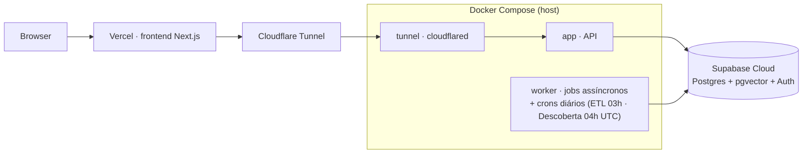
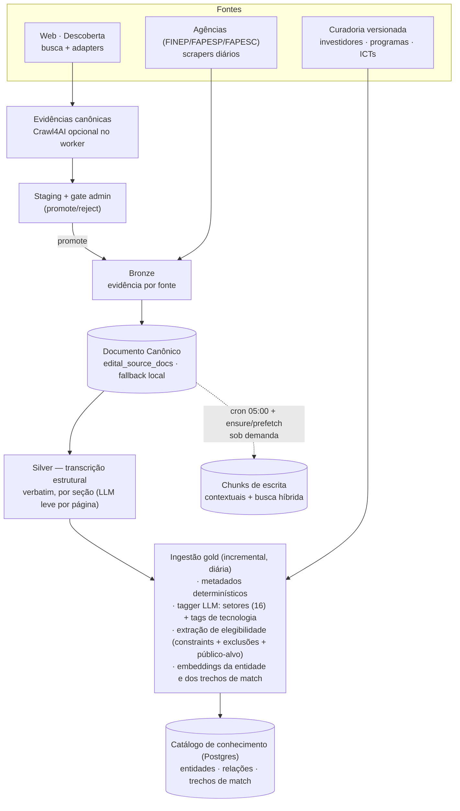
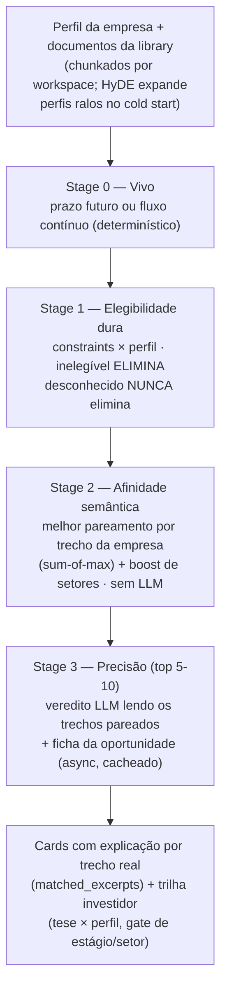

# Arquitetura — Radar de Editais

> **Autoridade:** runtime e fluxos implementados. Para regras de domínio, use
> [`WIKI.md`](../WIKI.md); para o mapa completo, use o
> [índice da documentação](README.md).

O produto conecta empresas early-stage/PME a oportunidades de fomento público
brasileiro através de três capacidades: **Explorar** (mapeamento do ecossistema
por catálogo e conversa), **Radar** (match empresa↔oportunidade) e **Projetos**
(propostas e pitches com RAG). **Descoberta** é a torneira operacional de novas
oportunidades com gate humano, não uma quarta jornada do usuário de produto.

Arquitetura v3 (concluída 2026-07-11): representações especializadas por
funcionalidade derivadas da mesma fonte — filtros estruturados + embeddings de
texto real para o match, tabelas relacionais para navegação, chunks contextuais
para escrita. Spec: [`docs/specs/v3-unified.md`](specs/v3-unified.md).

---

## 0. Deploy

Backend em Docker no host do operador, exposto via Cloudflare Tunnel (sem porta
aberta); frontend na Vercel; dados no Supabase Cloud.

---

## 1. Plano de dados — das fontes ao catálogo de conhecimento

Fontes fixas do pré-beta: editais (FINEP, FAPESP, FAPESC, web), 90 ICTs
EMBRAPII, 17 investidores e 10 programas curados à mão (versionados no repo).

**Entidades** (5 tipos): edital, programa, investidor, ICT, agência — com
setores (taxonomia fechada de 16), tags de tecnologia (folksonomia
normalizada), metadados de vigência/ticket e constraints de elegibilidade.
O produtor gold materializa três relações determinísticas: `operado_por`,
`subordinado_a` e `credenciada_por`. O catálogo ainda tolera a relação opcional
`exige_parceria_com` em dados compatíveis, mas a exigência atual é extraída como
constraint do edital, sem apontar para uma ICT específica. Relações semânticas emergem em tempo de
consulta (tags compartilhadas + busca vetorial), não são mantidas como arestas.

No gold, LLM aparece no tagger e na extração de elegibilidade. No índice de
escrita, contextual retrieval injeta contexto de capítulo antes dos embeddings;
as demais transformações são determinísticas e reexecutáveis.

---

## 2. Radar — funil de match em 4 estágios

Match sobre **texto real** (trechos da empresa × trechos da oportunidade),
nunca sobre conceitos abstratos extraídos.

Qualidade medida por gate absoluto (golden + hard negatives de elegibilidade);
parâmetros calibrados por bake-off: embeddings contextuais dos trechos de match
(venceram o cru por medição), agregação sum-of-max, boost de setores.

---

## 3. Escrita assistida

Sessão de escrita conversacional sobre um edital: primeiro turno gera o
rascunho completo (batch de seções), turnos seguintes iteram com o usuário.

- **RAG sobre o edital**: busca híbrida (densa + BM25 + rerank) nos chunks
  contextuais, aquecidos diariamente e garantidos sob demanda no engajamento.
- **Ficha da oportunidade** no contexto do agente: prazos, valores,
  elegibilidade, exclusões e público-alvo vindos do catálogo.
- **Guardrails**: Critic (subagente) + classificador de escopo antes de
  persistir rascunho; checklist de 3 passes paralelos (compliance, qualidade,
  completude) em background.
- **Playbooks por mecanismo** (subvenção, equity) guiam a estratégia do texto.

---

## 4. Mapeamento do ecossistema

Duas superfícies sobre o mesmo catálogo:

- **Catálogo navegável**: oportunidades, programas, investidores e ICTs com
  facetas por setor/tag, ficha por entidade e ofertas de investimento por fundo.
- **Exploração conversacional (ExploreAgent)**: agente com ferramentas de
  busca semântica de entidades ("quem atua em visão computacional?"), vizinhança
  estrutural (BFS nas relações), entidades relacionadas por tags compartilhadas,
  e o match como ferramenta. Respostas alimentam o perfil da empresa via
  diff sugerido (aceito pelo usuário — "AI drafts, humans decide").

---

## 5. Descoberta

Torneira de novas oportunidades da web (DOU e afins) → triagem → pacote
canônico de evidências → **staging com gate humano** (admin promove ou rejeita).

A staging recebe classificação de relevância v1 em shadow a cada extração
(`_row_with_relevance` → `classify_opportunity`). As colunas `relevance_*`
são aditivas, nunca alteram `status` editorial, e erro/abstenção nunca fabrica
`out_of_scope`. O gate humano permanece obrigatório; `in_scope` não promove
automaticamente. A classificação é exposta na UI administrativa como badge
+ progressive disclosure, sem filtrar ou reordenar candidatos.

O pacote preserva a proveniência da página, de documentos oficiais e de adapters;
o Crawl4AI é um enriquecimento opcional, executado apenas no worker, para cobrir
conteúdo dinâmico, links e lacunas de evidência. Ele não substitui scrapers ou
adapters dedicados.

O `promote` materializa a versão aprovada em bronze `web`, de forma auditável, e
reutiliza o `WebScraper` para o caminho silver → ingest do plano de dados. A
oportunidade então entra no catálogo, no match e no RAG como qualquer edital de
agência. Descoberta nunca escreve diretamente no catálogo; falhas no
enriquecimento permanecem isoladas no staging e não publicam conteúdo pendente.

---

## 6. Runtime agêntico e memória

Todos os agentes (escrita, explore, critic) rodam num único runtime LangGraph:

- **Grafo ReAct** (agent → tools → memória → reflect) com checkpointer
  Postgres durável — sessões sobrevivem a restart.
- **Human-in-the-loop** nativo via interrupt.
- **Memória cross-session** por workspace (Store semântico): leitura de insights
  existentes permanece ativa; escrita automática e síntese estão congeladas por
  default com `AUTO_MEMORY_WRITE=0`.
- **Isolamento multi-tenant** por workspace em todas as superfícies de dado do
  usuário (RLS + namespaces), coberto por leak-tests com Postgres real.

Cinco tiers de LLM trocáveis por env var (embeddings, contextual, extração
determinística, explore, escrita) — trocar um não afeta os outros.

Capacidades opcionais, experimentais e dormentes, com seus gates e fallbacks,
estão no [`ciclo de vida das capacidades`](reference/capability-lifecycle.md).

---

## 7. Avaliação

Harness unificado com suítes por funcionalidade (matching, RAG, escrita, entre
outras). `run` produz diagnóstico local por padrão; `--publish` envia uma
rodada completa ao Langfuse. `gate` aplica critérios versionados, rejeita
subconjuntos e distingue reprovação de qualidade, erro operacional e skip. Cada
JSON inclui manifesto de commit, datasets, modelos, configuração e
comparabilidade. Regra do projeto: gates medem **correção absoluta**, nunca
paridade com arquiteturas anteriores.

`extraction` é gate ativo. `matching` permanece candidato: além dos pisos de
MRR, recall e hard negatives, seu contrato exige zero falsos positivos
confirmados e zero resultados sem julgamento no top-8. Resultado não rotulado
não é tratado como erro do match, mas impede aprovação até revisão humana.
