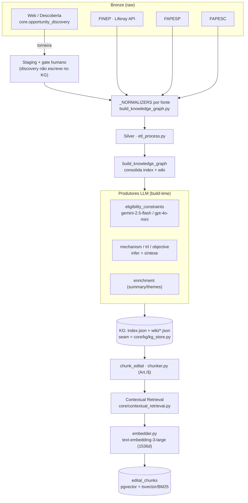
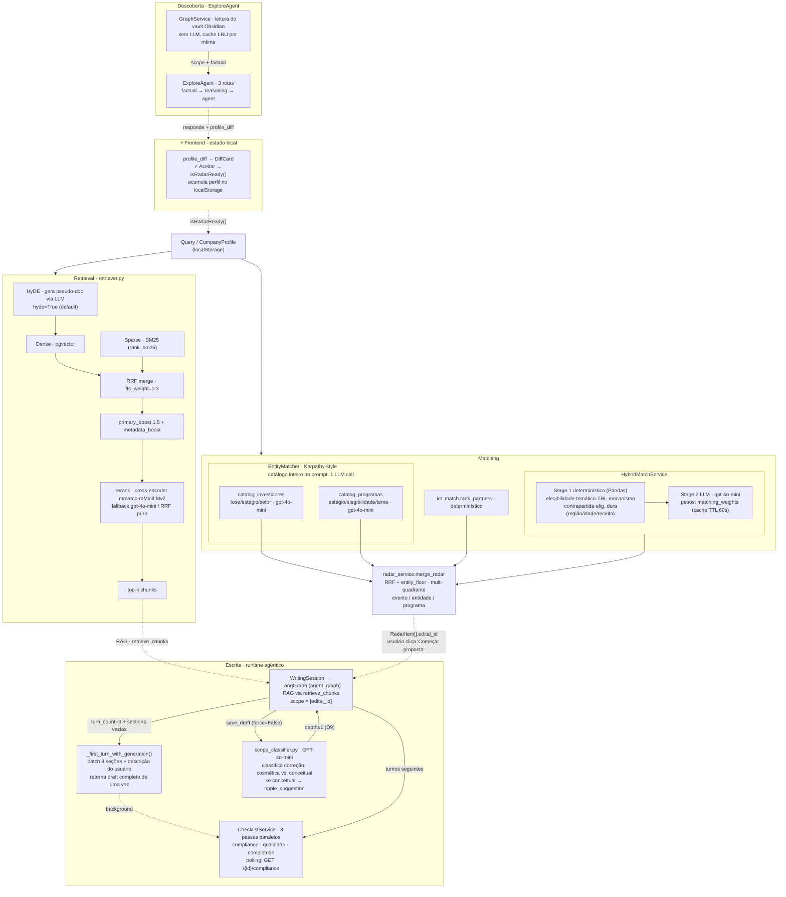
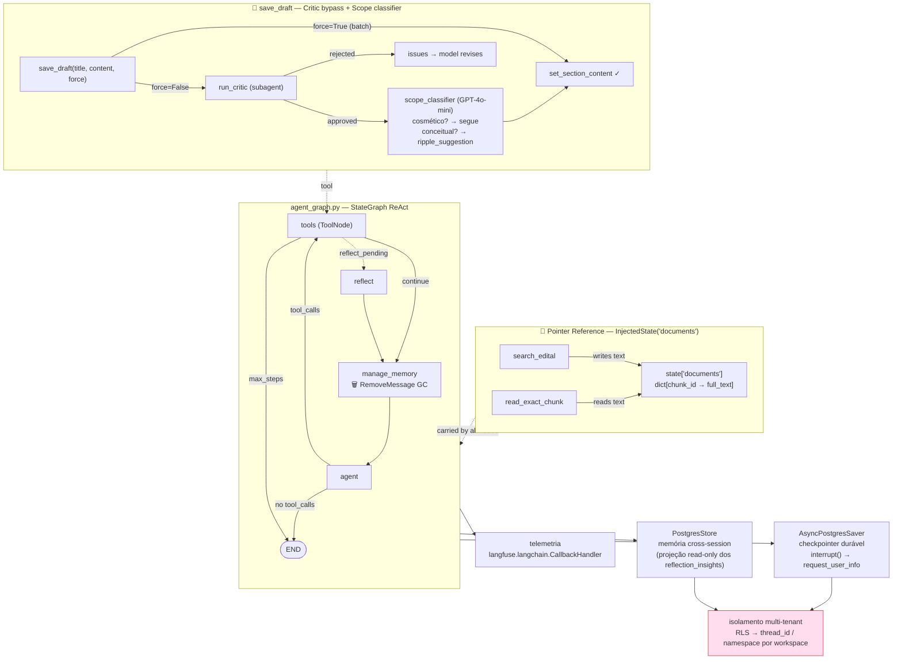
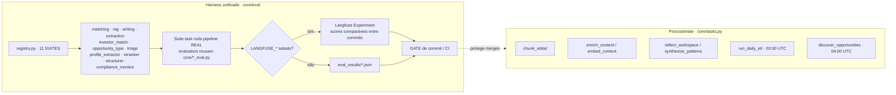

# Arquitetura — Radar de Editais

Visão de sistema para um Staff AI Engineer. O foco é onde a inteligência mora,
que modelo faz o quê, e como isso é medido — não o CRUD/auth/frontend.

> **Estado de implementação.** Os diagramas retratam a **arquitetura atual em produção**.
> O runtime LangGraph com checkpointer Postgres e Store semântico está **implementado e em produção**
> (migração completa — ver [`docs/components/agents/langgraph-migration.md`](components/agents/langgraph-migration.md) para o histórico).

---

## 1. Data plane — medallion ETL → Knowledge Graph → chunks

Multi-fonte com adapters por fonte; a descoberta web é uma "torneira" que passa
por gate humano antes de tocar o grafo. Produtores LLM rodam em build-time.

---

## 2. AI core (query time) — retrieval + matching dual + escrita

---

## 3. Runtime agêntico (alvo) — LangGraph

`StateGraph` ReAct com checkpointer Postgres durável, `interrupt()` nativo para
human-in-the-loop, memória cross-session via Store, e telemetria nativa. O
isolamento multi-tenant migra de RLS para `thread_id`/namespace por workspace —
o risco #1, gated por um leak test cross-workspace com Postgres real.

---

## 4. Eval + jobs assíncronos — o loop que mede

---

## Sinais que um Staff nota (e são reais no código)

| Sinal | Onde |
|---|---|
| Fallback determinístico antes do LLM | HybridMatch Stage 1 Pandas → Stage 2; rerank degrada p/ RRF puro |
| Modelo por tradeoff explícito | `llm_router` fast/pro/auto; produtores em free-tier (gemini), agregado em gpt-4o-mini |
| RAG não-ingênuo | BM25+dense via RRF com `fts_weight=0.3` justificado pelo corpus; contextual retrieval; dedup por source; HyDE ativo por default com fallback silencioso |
| Mede antes de mergear | 11 suítes no registry, gate de commit, Langfuse Experiments |
| Abstração de troca | `kg_store.py` como seam único; embedder/reranker/LLM parametrizáveis por env |
| Human-in-the-loop durável (alvo) | LangGraph `interrupt()` + checkpointer Postgres; isolamento via namespace por workspace |
