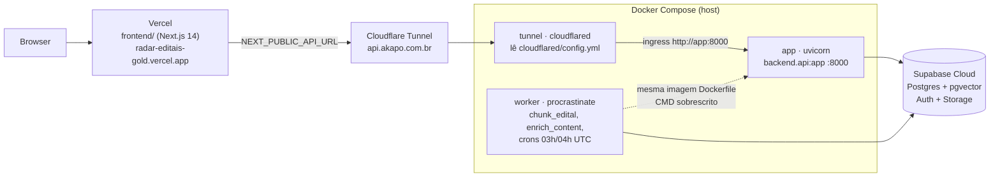
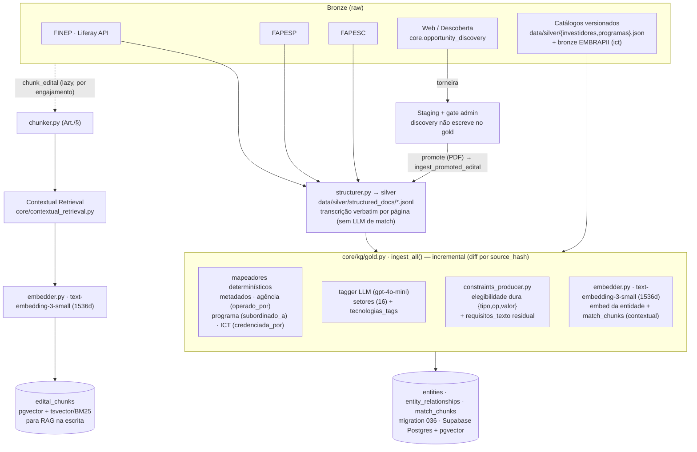
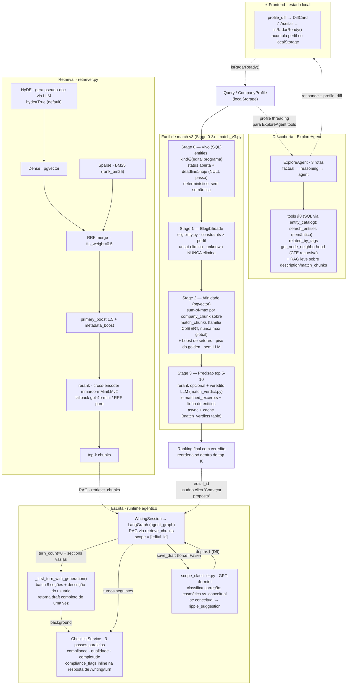
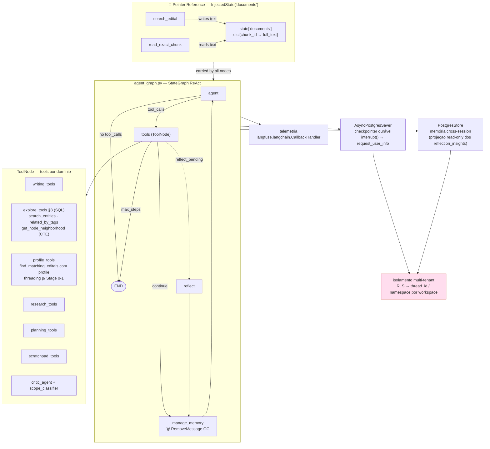

# Arquitetura — Radar de Editais

Visão de sistema para um Staff AI Engineer. O foco é onde a inteligência mora,
que modelo faz o quê, e como isso é medido — não o CRUD/auth/frontend.

> **Estado de implementação.** Os diagramas retratam a **arquitetura atual em produção**.
> O runtime LangGraph com checkpointer Postgres e Store semântico está **implementado e em produção**
> (migração completa — ver [`docs/components/agents/langgraph-migration.md`](components/agents/langgraph-migration.md) para o histórico).
> O KG migrou para tabelas **gold** relacionais (`entities`/`entity_relationships`/`match_chunks`,
> migration 036) — o hipergrado N-ário e o produtor hyper-extract foram removidos (v3 PR-C). O
> funil de match tem 4 estágios (`core/services/match_v3.py`): Stage 0 vivo (SQL) → Stage 1
> elegibilidade → Stage 2 afinidade sum-of-max (pgvector) → Stage 3 veredito LLM no top-K. Ver
> [`docs/specs/v3-unified.md`](specs/v3-unified.md) para a spec da migração.

---

## 0. Deploy — camadas de produção

4 camadas independentes, sem PaaS de backend: o app roda em Docker no host do
próprio operador, exposto à internet via Cloudflare Tunnel (sem porta aberta,
sem IP público).

- **Docker Compose** (`docker-compose.yml`): 3 serviços na mesma imagem
  (`Dockerfile`) — `app` (uvicorn), `worker` (procrastinate, sem HTTP; roda
  `chunk_edital`/`enrich_content`/`run_daily_etl` 03:00 UTC/`discover_opportunities`
  04:00 UTC) e `tunnel` (cloudflared). Volume `./data:/app/data` persiste bronze/silver
  entre restarts do container.
- **Cloudflare Tunnel** (`cloudflared/`, credenciais gitignored): expõe `app:8000`
  em `api.akapo.com.br` sem porta aberta no host nem IP público — `config.yml` só
  faz `ingress` para o serviço `app` dentro da rede docker-compose.
- **Vercel**: build do `frontend/` (Next.js 14), aponta pro backend via
  `NEXT_PUBLIC_API_URL=https://api.akapo.com.br`.
- **Supabase Cloud**: única fonte de dados durável — Postgres (schema + pgvector),
  Auth, Storage. O catálogo/match v3 vive nas tabelas gold (migration 036); a
  tabela legada `kg_artifacts` (blob JSONB, `KG_STORE_BACKEND`) só guarda o ledger
  do discovery — o drop dela é follow-up pós-deploy (ver handoff PR-C).
- Runbook completo: [`scripts/deploy.sh`](../scripts/deploy.sh).

---

## 1. Data plane — Bronze → Gold → Chunks

Multi-fonte com adapters por fonte; a descoberta web é uma "torneira" que passa
por gate admin antes de entrar no catálogo. O produtor é `core/kg/gold.py`
(`ingest_all`), dentro do `run_daily_etl` — a linhagem hyper-extract (hipergrafos)
foi removida no v3 PR-C.

---

## 2. AI core (query time) — funil de match 3 estágios + retrieval + escrita

---

## 3. Runtime agêntico — LangGraph

`StateGraph` ReAct com checkpointer Postgres durável, `interrupt()` nativo para
human-in-the-loop, memória cross-session via Store, e telemetria nativa. O
isolamento multi-tenant usa `thread_id`/namespace por workspace (migrou de RLS) —
o risco #1, coberto por leak test cross-workspace com Postgres real
(`tests/test_tenant_isolation.py`, rodado 2026-07-03).

---

## 4. Eval + jobs assíncronos — o loop que mede

```mermaid
flowchart LR
  subgraph EVAL["Harness unificado · core/eval"]
    REG["registry.py · 11 SUITES"]
    REG --> S["matching · rag · writing · extraction<br/>profile_extractor · reranker · structurer · compliance_monitor · focus_group"]
    S --> H["Suite.task roda pipeline REAL<br/>evaluators reusam core/*_eval.py"]
    H --> OUT{"LANGFUSE_* setado?"}
    OUT -->|sim| LF["Langfuse Experiment<br/>scores comparáveis entre commits"]
    OUT -->|não| LOCAL["eval_results/*.json"]
    LF --> GATE["GATE de commit / CI"]
    LOCAL --> GATE
  end

  subgraph JOBS["Procrastinate · core/tasks.py"]
    J1["chunk_edital"]
    J2["enrich_content / embed_content"]
    J3["reflect_workspace / synthesize_patterns"]
    J4["run_daily_etl · 03:00 UTC"]
    J5["discover_opportunities · 04:00 UTC"]
    J6["compute_match_verdicts<br/>LLM verdicts no top-K<br/>cache + queueing_lock"]
  end

  subgraph SCRIPTS["CLI / ops (scripts/)"]
    S1["core/kg/gold.py · ingest_all (CLI)<br/>catálogo/match gold — roda no run_daily_etl"]
    S2["reindex_edital / reindex_all<br/>re-chunk RAG (edital_chunks)"]
    S3["export_to_obsidian<br/>vault Obsidian a partir do gold"]
  end

  GATE -.->|"protege merges"| JOBS
  GATE -.-> SCRIPTS
```

---

## 5. Sinais que um Staff nota (e são reais no código)

| Sinal | Onde |
|---|---|
| Funil de match v3 (Stage 0-3) — cada estágio com motor diferente (SQL → elegibilidade → pgvector → LLM) e custo crescente | `core/services/match_v3.py` (Stage 0-2) + `match_verdict.py` (Stage 3, K≪N) — não há LLM no ranking, só no veredito do top-K |
| Stage 2 = sum-of-max por chunk da empresa (família ColBERT, nunca max global) sobre `match_chunks`, evita inflação por trechos redundantes | `match_v3.py` — piso calibrado no golden da Fase 1.5; boost opcional por setores ∩ |
| Modelo por tradeoff explícito | `llm_router` fast/pro/auto; produtores em free-tier (gemini), agregado em gpt-4o-mini; embedding small para nós, large para chunks |
| RAG não-ingênuo | BM25+dense via RRF com `fts_weight=0.5` justificado pelo corpus; contextual retrieval; dedup por source; HyDE ativo por default com fallback silencioso |
| Elegibilidade é estágio determinístico, não raciocínio do agente | `eligibility.py` — constraints tipadas (porte/UF/faturamento/TRL/forma_jurídica) × perfil → sat/unsat/unknown; unknown nunca elimina, gera flag no card |
| Veredito LLM assíncrono com cache | `match_verdict.py`: task procrastinate + tabela `match_verdicts` com input_hash; card renderiza sem veredito, recebe pronto via poll |
| Mede antes de mergear | 11 suítes no registry, gate de commit, Langfuse Experiments |
| Abstração de troca | `kg_store.py` como seam único; embedder/reranker/LLM parametrizáveis por env; adapters com `provenance()` por fonte |
| Schema v2 reduziu 12 tipos de nó para 3 + propriedades | Oportunidade/Ator/Conceito; Mecanismo/Requisito/Exclusão/Fonte viram propriedades ou são removidos; IDs estáveis prefixados resolvem travessia cross-fonte |
| Human-in-the-loop durável | LangGraph `interrupt()` + checkpointer Postgres; isolamento via namespace por workspace |
