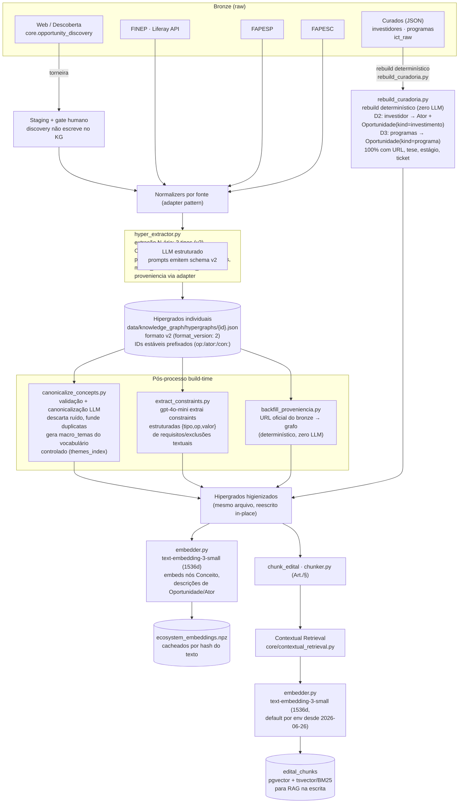
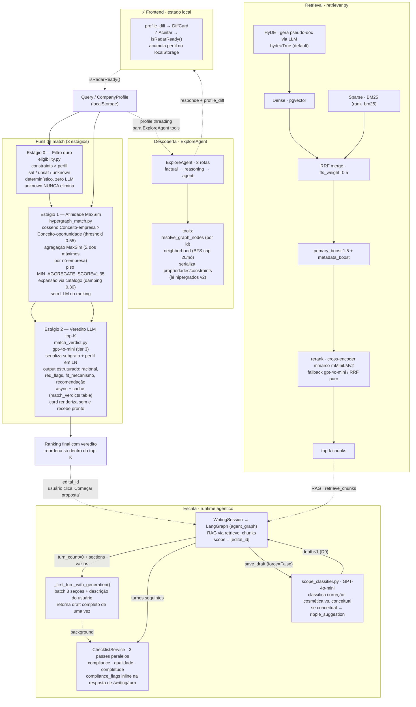

# Arquitetura — Radar de Editais

Visão de sistema para um Staff AI Engineer. O foco é onde a inteligência mora,
que modelo faz o quê, e como isso é medido — não o CRUD/auth/frontend.

> **Estado de implementação.** Os diagramas retratam a **arquitetura atual em produção**.
> O runtime LangGraph com checkpointer Postgres e Store semântico está **implementado e em produção**
> (migração completa — ver [`docs/components/agents/langgraph-migration.md`](components/agents/langgraph-migration.md) para o histórico).
> O schema do hipergrado foi consolidado para KG v2 (3 tipos: `Oportunidade`/`Ator`/`Conceito`,
> supersede os 12 tipos originais). O funil de match tem 3 estágios: filtro duro de elegibilidade
> → MaxSim → veredito LLM no top-K. Ver [`docs/specs/kg-redesign.md`](specs/kg-redesign.md) para
> histórico completo das decisões (D1–D16) e registro de divergências PR a PR.

---

## 1. Data plane — Bronze → Hipergrafo v2 → Chunks

Multi-fonte com adapters por fonte; a descoberta web é uma "torneira" que passa
por gate humano antes de tocar o grafo.

---

## 2. AI core (query time) — funil de match 3 estágios + retrieval + escrita

---

## 3. Runtime agêntico — LangGraph

`StateGraph` ReAct com checkpointer Postgres durável, `interrupt()` nativo para
human-in-the-loop, memória cross-session via Store, e telemetria nativa. O
isolamento multi-tenant usa `thread_id`/namespace por workspace (migrou de RLS) —
o risco #1, coberto por leak test cross-workspace com Postgres real
(`tests/test_tenant_isolation.py`, rodado 2026-07-03).

---

## 4. Eval + jobs assíncronos — o loop que mede

```mermaid
flowchart LR
  subgraph EVAL["Harness unificado · core/eval"]
    REG["registry.py · 11 SUITES"]
    REG --> S["matching · rag · writing · extraction<br/>profile_extractor · reranker · structurer · compliance_monitor · focus_group"]
    S --> H["Suite.task roda pipeline REAL<br/>evaluators reusam core/*_eval.py"]
    H --> OUT{"LANGFUSE_* setado?"}
    OUT -->|sim| LF["Langfuse Experiment<br/>scores comparáveis entre commits"]
    OUT -->|não| LOCAL["eval_results/*.json"]
    LF --> GATE["GATE de commit / CI"]
    LOCAL --> GATE
  end

  subgraph JOBS["Procrastinate · core/tasks.py"]
    J1["chunk_edital"]
    J2["enrich_content / embed_content"]
    J3["reflect_workspace / synthesize_patterns"]
    J4["run_daily_etl · 03:00 UTC"]
    J5["discover_opportunities · 04:00 UTC"]
    J6["compute_match_verdicts<br/>LLM verdicts no top-K<br/>cache + queueing_lock"]
  end

  subgraph SCRIPTS["Scripts build-time"]
    S1["migrate_hypergraphs_v2.py<br/>PR1: ids estáveis + migração"]
    S2["canonicalize_concepts.py<br/>PR3: higiene + canon + macro_temas"]
    S3["backfill_proveniencia.py<br/>PR4: URL do bronze → grafo"]
    S4["extract_constraints.py<br/>PR5: constraints de requisitos textuais"]
    S5["rebuild_curadoria.py<br/>PR4.1: rebuild determinístico curados"]
  end

  GATE -.->|"protege merges"| JOBS
  GATE -.-> SCRIPTS
```

---

## 5. Sinais que um Staff nota (e são reais no código)

| Sinal | Onde |
|---|---|
| Funil de match 3 estágios — cada estágio com motor diferente (determinístico → geométrico → LLM) e custo crescente | `hypergraph_match.py` (Estágio 0/1) + `match_verdict.py` (Estágio 2, K≪N) — não há LLM no ranking, só no veredito do top-K |
| Agregação MaxSim substituiu marginsum: evita inflação por nós redundantes, ganho forward-looking para late-interaction | `hypergraph_match.py:_maxsim()` — recalibrado empiricamente no golden (1.35 / 0.60), sweep revelou platô fino antes do precipício |
| Modelo por tradeoff explícito | `llm_router` fast/pro/auto; produtores em free-tier (gemini), agregado em gpt-4o-mini; embedding small para nós, large para chunks |
| RAG não-ingênuo | BM25+dense via RRF com `fts_weight=0.5` justificado pelo corpus; contextual retrieval; dedup por source; HyDE ativo por default com fallback silencioso |
| Elegibilidade é estágio determinístico, não raciocínio do agente | `eligibility.py` — constraints tipadas (porte/UF/faturamento/TRL/forma_jurídica) × perfil → sat/unsat/unknown; unknown nunca elimina, gera flag no card |
| Veredito LLM assíncrono com cache | `match_verdict.py`: task procrastinate + tabela `match_verdicts` com input_hash; card renderiza sem veredito, recebe pronto via poll |
| Mede antes de mergear | 11 suítes no registry, gate de commit, Langfuse Experiments |
| Abstração de troca | `kg_store.py` como seam único; embedder/reranker/LLM parametrizáveis por env; adapters com `provenance()` por fonte |
| Schema v2 reduziu 12 tipos de nó para 3 + propriedades | Oportunidade/Ator/Conceito; Mecanismo/Requisito/Exclusão/Fonte viram propriedades ou são removidos; IDs estáveis prefixados resolvem travessia cross-fonte |
| Human-in-the-loop durável | LangGraph `interrupt()` + checkpointer Postgres; isolamento via namespace por workspace |
